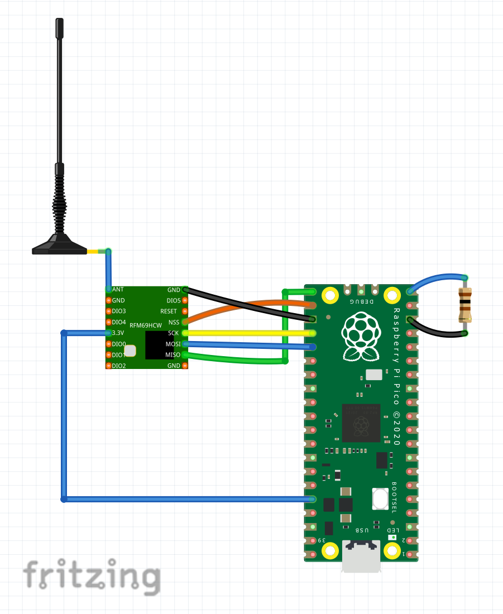

# mioty End-Point Example

## 🌐 What is mioty?

mioty (short for "massive-IoT" and also "my-IoT") is a revolutionary Low Power Wide Area Network (LPWAN) technology initially developed by Fraunhofer IIS. Today, mioty is promoted and advanced by the **mioty Alliance** and its members - a global community of companies, institutes, and developers working together to create the most accessible, robust, and efficient IoT connectivity solution on the market.

**Why mioty is perfect for IoT projects:**

- **Long Range**: Up to 15km in rural areas, 3-5km in cities
- **Ultra Low Power**: Devices can run for years on a single battery  
- **Massive Capacity**: Supports 1 million+ daily telegrams per base station
- **Robust Communication**: Works reliably even in challenging RF environments
- **Cost Effective**: Less base stations needed to deploy your own network

Unlike other LPWAN technologies, mioty uses a unique telegram splitting approach that makes it extremely robust against interference and allows for truly massive device deployments.

## 🤝 About the mioty Alliance

The **mioty Alliance** is a global ecosystem of technology leaders, hardware manufacturers, system integrators, and service companies united by a shared vision: enabling the most accessible, robust, and efficient massive IoT connectivity solution.

The Alliance provides an open, standardized, and interoperable ecosystem across the entire IoT value chain - from end-point devices and base stations to IoT platforms and applications. This collaborative approach ensures that mioty technology continues to evolve and remains future-proof for all users.

## 🎯 mioty End-Point Example: Modular Architecture Showcase

This project is designed as a **comprehensive example** that demonstrates mioty technology concepts and modular architecture while remaining accessible to everyone. Built around affordable hardware for less than **$10**, it combines:

- **Raspberry Pi Pico** (~$3) - Easily replaceable with any microcontroller
- **HopeRF RFM69HW** (~$2) - Modular design allows any mioty radio module
- **Open Source TS-UNB Library** from Fraunhofer - Can be swapped with commercial libraries

**What makes this example special:**

- **💡 Modular Design**: Demonstrates how components can be easily replaced and extended
- **🏗️ Best Practice Patterns**: Shows clean architecture and separation of concerns
- **📚 Educational Focus**: Every design decision is documented and explained for learning
- **🔧 Accessible Hardware**: Uses widely available components to keep costs under $10
- **🚀 End-to-End Demo**: Complete working system demonstrating mioty concepts

⚠️ **Important Note**: This open-source project is designed for **learning, experimentation, and getting started with mioty**. The modular architecture allows easy migration to production-grade components - replace the RP2040 with industrial microcontrollers, swap in commercial TS-UNB libraries from Fraunhofer or Stackforce, or use different radio modules as needed.

## 🚀 Key Features & Concepts Demonstrated

- **📋 Flexible Payload Design**: Example 8-byte header + sensor data format showcasing mioty concepts
- **📑 Complete Blueprint Definition**: Demonstrates proper mioty blueprint creation for base station integration  
- **🏗️ Modular Architecture**: Clean separation between hardware drivers, application logic, and configuration
- **📡 mioty Integration Example**: Working TS-UNB protocol implementation with RFM69HW
- **📊 Efficient Data Transmission**: Binary payload format optimized for power and bandwidth
- **🌡️ Extensible Sensor Framework**: Template showing how to add any sensor type
- **🔧 Component Replaceability**: Every major component can be swapped for different hardware
- **� Persistent Frame Counter**: Flash-based storage ensures frame counter survives reboots for production reliability
- **�💰 Accessible Learning**: Sub-$10 BOM using widely available components

## 📁 Modular Project Structure

The project demonstrates **flexible, component-based organization** for mioty end-point development:

```text
mioty-end-point-example/
├── src/                          # Application layer (easily customizable)
│   ├── main.cpp                  # Clean entry point and main loop
│   ├── app/                      # Application business logic
│   └── config/                   # Centralized configuration management
├── drivers/                      # Hardware abstraction layer (replaceable)
│   ├── mioty/                    # mioty protocol implementation
│   └── sensors/                  # Sensor drivers with unified interface
├── lib/                          # Core libraries (swappable)
│   ├── utils/                    # Helper functions and utilities
│   └── ts-unb-lib-rfm69/         # TS-UNB library (replaceable with commercial)
└── docs/                         # Comprehensive documentation
```

**Key Architecture Benefits:**

- **Component Independence**: Each layer can be replaced without affecting others
- **Easy Experimentation**: Swap hardware or libraries to test different approaches
- **Learning-Friendly**: Clear structure makes it easy to understand each component's role
- **Migration Path**: Start with example components, upgrade to specialized ones as needed
- **Extensible Design**: Add new sensors or features without restructuring

This structure demonstrates how to organize mioty projects for maximum flexibility and component reusability.

## 🎯 Getting Started

### What You'll Need

**Hardware:**

- Raspberry Pi Pico (any variant with RP2040)
- RFM69HW radio module (868MHz for Europe, 915MHz for US)
- Breadboard and jumper wires for prototyping
- USB cable for programming and power

**Software:**

- Visual Studio Code (recommended)
- Raspberry Pi Pico extension for VS Code
- Git for downloading the project

**Optional but Helpful:**

- Basic soldering kit for permanent connections
- Multimeter for troubleshooting
- mioty base station for testing, for example [miotyGO](https://github.com/loriot/miotyGO/tree/master)

### Hardware Connections

Connect your RFM69HW module to the Raspberry Pi Pico following this simple wiring diagram:

| RFM69HW Pin | Pico GPIO | Wire Color | Purpose |
|-------------|-----------|------------|---------|
| SCK | GP18 | Yellow | SPI Clock |
| MOSI | GP19 | Blue | Data to Radio |
| MISO | GP16 | Green | Data from Radio |
| NSS | GP17 | Orange | Chip Select |
| RESET | GP22 | Red | Reset Radio |
| GND | GND | Black | Ground |
| 3.3V | 3V3 | Red | Power |

**Optional: Power Bank Keep-Alive (for USB power bank compatibility):**

| Component | Pico GPIO | Purpose |
|-----------|-----------|---------|
| 100Ω Resistor to GND | GP15 | Dummy load for power banks |

💡 **Power Bank Tip**: If powering from a USB power bank, connect a 100Ω, 0.25W resistor between GP15 and GND. This prevents the power bank from auto-shutting off due to low current draw. See `docs/POWERBANK_KEEPALIVE.md` for details.

💡 **Beginner Tip**: Use a breadboard for your first setup. Once everything works, you can create a more permanent solution with a custom PCB or perfboard.

#### Wiring Diagram

Here's a visual representation of the complete setup:



*The diagram shows the Raspberry Pi Pico connected to the RFM69HW radio module with the antenna, following the pin connections specified in the table above.*

### Software Setup

1. **Get the code:**

```bash
git clone <your-repo-url>
cd mioty-endpoint-example
```

2. **Open in VS Code:**
   - Install the "Raspberry Pi Pico" extension
   - Open the project folder
   - The extension will guide you through SDK setup

3. **Build the project:**
   - Press `Ctrl+Shift+P` and select "Raspberry Pi Pico: Configure CMake"
   - Press `Ctrl+Shift+P` and select "Raspberry Pi Pico: Compile"

4. **Flash to your Pico:**
   - Hold the BOOTSEL button on your Pico
   - Connect the USB cable
   - Release BOOTSEL (Pico appears as USB drive)
   - Copy the generated `.uf2` file to the Pico drive
   - The Pico will restart automatically

### 📺 Monitoring Your Device

Once your device is running, you can monitor its activity and debug any issues using Visual Studio Code's built-in Serial Monitor:

1. **Install the Serial Monitor extension:**
   - In VS Code, go to Extensions (`Ctrl+Shift+X`)
   - Search for "Serial Monitor" by Microsoft
   - Install the official extension

2. **Start monitoring:**
   - Press `Ctrl+Shift+P` and select "Serial Monitor: Start Monitoring"
   - Select your Pico's COM port (usually shows as "Board CDC" or similar)
   - Set baud rate to 115200
   - You'll see real-time logs showing:
     - Sensor readings and calibration
     - mioty transmission attempts and results
     - System status and error messages
     - Power management and sleep cycles

💡 **Debugging Tip**: The logs will help you understand what your device is doing and troubleshoot any connectivity or sensor issues. Look for transmission confirmations and any error messages.

🎉 **Success!** Your mioty node should now be running and sending temperature data every 60 seconds.

## 📡 mioty Concepts: Payload Design & Blueprint Creation

This example demonstrates **key mioty concepts** including payload design and blueprint creation, showing how to build a complete end-to-end mioty system.

### Binary Protocol Design Concepts

The system demonstrates a **compact binary protocol** that showcases:

- **Efficient Data Format**: Short transmissions for better battery life and range
- **Structured Approach**: Consistent header + sensor data organization  
- **Extensible Design**: Easy to add new sensors while maintaining compatibility
- **Blueprint Integration**: Proper definition for base station decoding

### Complete mioty Data Flow Example

Every transmission demonstrates the full mioty pipeline:

1. **Sensor Reading** → Clean data acquisition with error handling
2. **Payload Composition** → Binary formatting with proper scaling
3. **mioty Transmission** → TS-UNB protocol implementation
4. **Blueprint Decoding** → Base station integration with structured output

### Example: Temperature Data Transmission

When measuring 23.45°C, the system creates a formatted payload:

```
01 01 00 01 14 01 00 00 29 09
```

That's what we call the payload. More details about what this means later.

### Modular Sensor Integration

The framework demonstrates **flexible sensor integration patterns**:

**Adding Humidity Sensor Example:**

1. **Hardware Integration** - Connect sensor using standard I2C/SPI patterns
2. **Driver Implementation** - Follow the provided sensor interface template  
3. **Payload Extension** - Add sensor data after the header
4. **Blueprint Update** - Extend the mioty blueprint with new component definitions

The modular approach ensures **easy expansion** - add new sensors without changing existing code.

## 📊 Payload Format & Blueprint Design Example

This section demonstrates **mioty blueprint creation** - showing how to define payload structures for base station integration. The blueprint is the key standard that defines how base stations decode device data.

### Example Payload Structure

This example uses a 10-byte payload format to demonstrate mioty concepts:

```
[8-byte Header][2-byte Temperature Data]
```

**Note**: The 8-byte header shown here is **one suggested approach** for organizing payload data, not an industry standard. The **mioty blueprint definition is the actual standard** - manufacturers can structure their payloads in any way that works with the blueprint format.

#### Complete Payload Breakdown

| Bytes | Field | Description | Example Value |
|-------|-------|-------------|---------------|
| 0 | Payload Version | Structure version | `0x01` |
| 1-2 | Firmware Version | Major.Minor (2 bytes) | `0x01 0x00` (v1.0) |
| 3 | Hardware Version | Board revision | `0x01` |
| 4 | TX Power | Transmission power (dBm) | `0x14` (20 dBm) |
| 5 | Trigger Type | What caused transmission | `0x01` (Timer) |
| 6-7 | Reserved | Future use | `0x00 0x00` |
| 8-9 | Temperature | Sensor data (scaled x100) | `0x29 0x09` (23.45°C) |

#### Example Complete Payload

```
01 01 00 01 14 01 00 00 29 09
└─────── Header ──────┘└─Temp─┘
```

Where temperature `23.45°C` becomes `2345` (scaled by 100) = `0x2909` in big-endian format.

### mioty Blueprint Example

This complete blueprint demonstrates how to define payload structures for mioty base stations:

```json
{
  "version": "1.0",
  "typeEui": "70b3d56770000001",
  "meta": {
    "name": "mioty End-Point Example - Temperature Only",
    "vendor": "mioty Alliance",
    "description": "RP2040 + RFM69HW with internal temperature sensor"
  },
  "uplink": [
    {
      "id": 0,
      "crypto": 0,
      "payload": [
        {
          "name": "payload_version",
          "component": "8bitUnsigned"
        },
        {
          "name": "firmware_major",
          "component": "8bitUnsigned"
        },
        {
          "name": "firmware_minor",
          "component": "8bitUnsigned"
        },
        {
          "name": "hardware_version",
          "component": "8bitUnsigned"
        },
        {
          "name": "tx_power_dbm",
          "component": "8bitSigned"
        },
        {
          "name": "trigger_type",
          "component": "8bitUnsigned"
        },
        {
          "name": "reserved1",
          "component": "8bitUnsigned"
        },
        {
          "name": "reserved2",
          "component": "8bitUnsigned"
        },
        {
          "name": "temperature",
          "component": "16bitTemperature"
        }
      ]
    }
  ],
  "component": {
    "8bitUnsigned": {
      "size": 8,
      "type": "int",
      "func": "$",
      "unit": "",
      "littleEndian": false
    },
    "8bitSigned": {
      "size": 8,
      "type": "int",
      "func": "$",
      "unit": "dBm",
      "littleEndian": false
    },
    "16bitTemperature": {
      "size": 16,
      "type": "int",
      "func": "$/100",
      "unit": "°C",
      "littleEndian": false
    }
  }
}
```

This blueprint shows the mioty base station exactly how to decode the payload and present the data in a structured format.

### Version-Based Backward Compatibility Strategy

The key insight is that **each payload structure gets its own unique TypeEUI** in the mioty system. This allows base stations to support multiple device types simultaneously while maintaining clean separation between different payload formats.

**The Process:**

1. **Start with Version 1**: Temperature-only devices use `typeEui: "70b3d56770000001"`
2. **Add sensors in Version 2**: Temperature + Humidity devices get `typeEui: "70b3d56770000002"`  
3. **Continue evolution**: Each new sensor combination gets its own TypeEUI
4. **Base station support**: The base station can decode all versions simultaneously

#### Practical Example: Adding Humidity Sensor

**Current Implementation (Version 1):**
```cpp
// In payload_config.hpp
namespace CurrentConfig {
    constexpr uint8_t PAYLOAD_VERSION = 1;
    constexpr SensorConfig SENSOR_CONFIGS[] = {
        {SensorType::INTERNAL_TEMPERATURE, 1, 100, 2}  // int16, x100 scaling
    };
}
```

**Blueprint:** `typeEui: "70b3d56770000001"` → 10 bytes total
```
[8-byte Header][2-byte Temperature] = 10 bytes
```

**Future Implementation (Version 2):**
```cpp
// In payload_config.hpp  
namespace V2Config {
    constexpr uint8_t PAYLOAD_VERSION = 2;
    constexpr SensorConfig SENSOR_CONFIGS[] = {
        {SensorType::INTERNAL_TEMPERATURE, 1, 100, 2},  // int16, x100 scaling
        {SensorType::HUMIDITY, 2, 100, 2}               // uint16, x100 scaling
    };
}
```

**New Blueprint:** `typeEui: "70b3d56770000002"` → 12 bytes total
```
[8-byte Header][2-byte Temperature][2-byte Humidity] = 12 bytes
```

#### Base Station Configuration

The base station supports both device types simultaneously:

```json
{
  "supportedDevices": [
    {
      "typeEui": "70b3d56770000001",
      "name": "Temperature Sensor v1",
      "payloadLength": 10
    },
    {
      "typeEui": "70b3d56770000002", 
      "name": "Temperature + Humidity Sensor v2",
      "payloadLength": 12
    }
  ]
}
```

This approach ensures **reliable operation** while allowing your mioty network to evolve and grow with new capabilities.

### Extending the Payload Structure

The modular design makes it easy to add more sensors. Here's how the payload could evolve:

#### Adding Humidity Sensor (Future)

```
[8-byte Header][2-byte Temperature][2-byte Humidity] = 12 bytes total
```

#### Adding Multiple Sensors (Future)

```
[8-byte Header][Temperature][Humidity][Pressure][Battery] = 16 bytes total
```

When adding sensors:

1. **Sensor data always follows the 8-byte header**
2. **Order matters** - sensors must be added in the same sequence in both firmware and blueprint
3. **New TypeEUI required** - each different payload structure needs its own unique identifier
4. **Blueprint components expand** - new sensor types get added to the component definitions

#### Key Design Concepts

- **Flexible Header Design** - The header format can be adapted to your specific needs
- **Sequential Sensor Data** - New sensor data is added after existing sensors
- **Consistent Scaling** - Sensors use consistent scaling (e.g., x100 for decimal precision)
- **Big-endian Format** - Multi-byte values use most significant byte first
- **Blueprint Compatibility** - Any payload structure works as long as it's properly defined in the blueprint

This approach ensures that as you add sensors to your project, the base station can properly decode and display all collected data.

## ⚙️ Customizing Your Node

### Basic Configuration

All the important settings are in easy-to-find configuration files:

- **Hardware Settings** (`board_config.hpp`): Which pins connect to what
- **Application Settings** (`app_config.hpp`): How often to send data, transmission power
- **Sensor Settings** (`payload_config.hpp`): What data to include

### Adding New Sensors

The system is designed to make adding sensors simple:

1. **Connect your sensor** to the Pico (I2C, SPI, or analog)
2. **Add a driver** (we provide templates and examples)
3. **Update the configuration** to include your sensor data
4. **Rebuild and flash** - your new sensor is now part of the system

### Example: Adding a Humidity Sensor

```cpp
// In payload_config.hpp, add:
HUMIDITY = 0x03,  // New sensor type

// In your application:
humidity_sensor.read();
payload_builder.addSensorData(SensorType::HUMIDITY, humidity_value);
```

The system handles everything else automatically.

## 🔧 Learning from the Example

This example provides **modular patterns and concepts** you can adapt for your own mioty projects. Every component demonstrates clean architecture and replaceability.

### Sensor Integration Concepts

The temperature sensor implementation demonstrates **flexible development approaches**:

- **Hardware Abstraction**: Clean separation between sensor interface and implementation
- **Error Handling**: Proper validation and fallback strategies  
- **Configuration Management**: Centralized settings for easy adaptation
- **Data Formatting**: Consistent scaling and binary encoding
- **Testing Support**: Built-in diagnostics and validation

### Architecture Benefits for Real Projects

The framework demonstrates patterns that **adapt to different needs**:

- **Modular Components**: Easy to replace, test, and extend independently
- **Clear Interfaces**: Well-defined boundaries between system layers
- **Configuration-Driven**: Adapt to different scenarios without code changes
- **Documentation Focus**: Every design decision is explained for learning
- **Flexibility Examples**: Reference implementation showing component replaceability

Use this example as a **starting point for your own mioty projects** - the modular patterns demonstrated here make it easy to customize for your specific needs.

## 🚀 Building Your Own mioty Solutions

This end-point example provides the **foundation and modular concepts** for creating your own mioty-connected devices. The patterns demonstrated here enable projects like:

**Environmental Monitoring:**

- Temperature, humidity, air quality sensors using the sensor framework patterns
- Multi-sensor payloads following the extensible blueprint design
- Battery-optimized transmission schedules for long-term deployments

**Asset & Location Tracking:**

- GPS integration using the standardized sensor interface
- Position data encoding following the binary payload patterns  
- Low-power location reporting for vehicles, equipment, or livestock

**Smart Agriculture & Industrial IoT:**

- Soil sensors, equipment monitoring using the modular driver architecture
- Custom payload structures following the blueprint concepts
- Robust outdoor deployments using the demonstrated patterns

**The mioty Advantage:**

With this example as your starting point, you can build devices that operate **for years on batteries** while communicating over **kilometers of range** - perfect for IoT applications where traditional connectivity falls short.

The key is leveraging the **modular patterns** demonstrated in this example: efficient payloads, proper blueprints, clean architecture, and component replaceability.

## 📄 License & Support

This project uses a dual-license structure:

- **Framework Code**: MIT License © 2025 mioty Alliance e.V.
- **TS-UNB-Lib**: Fraunhofer TS-UNB-Lib License (academic/non-commercial use)

The Fraunhofer TS-UNB-Lib is included as a third-party library with its original licensing terms. For commercial use of the mioty protocol, contact Sisvel International S.A. for patent licensing.

## 📞 Contact & Resources

**mioty Alliance e.V.**  
Technical Contact: Micha Burger  
Email: micha.burger@mioty-alliance.com

**Learn More:**

- [mioty Alliance Website](https://mioty-alliance.com)
- [TS-UNB Protocol Documentation](https://www.etsi.org/deliver/etsi_ts/103300_103399/103357/)
- [Raspberry Pi Pico Documentation](https://datasheets.raspberrypi.org/pico/pico-datasheet.pdf)

**Community:**

- Report issues via GitHub Issues
- Feature requests welcome
- Pull requests encouraged

## 🤖 Acknowledgments

This project has been developed with the invaluable assistance of **Claude Sonnet 4**, which helped design the architecture, write documentation, and ensure code quality throughout the development process.
